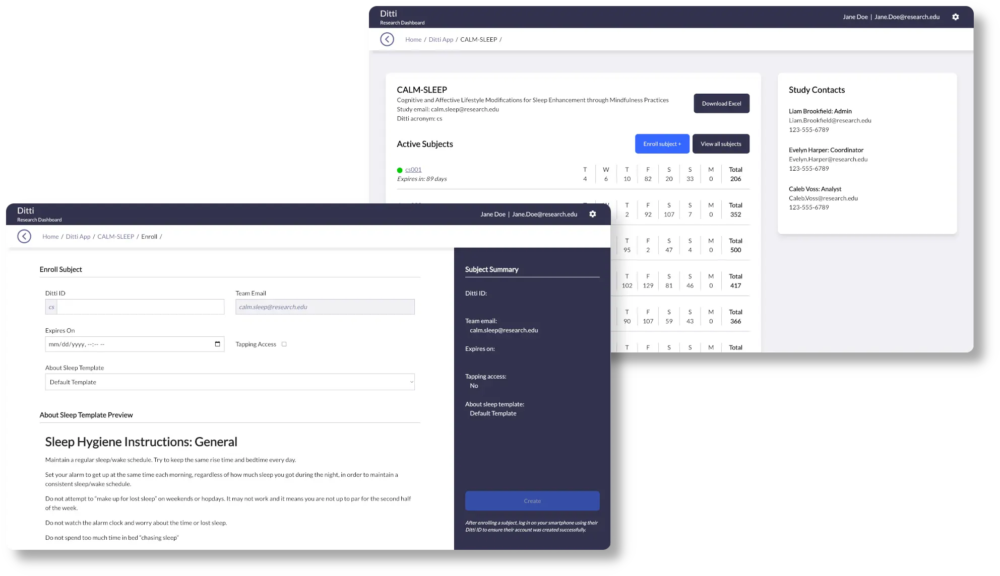

# Ditti Research Dashboard

The Ditti Research Dashboard is a centralized platform for managing and visualizing data collected from the [Penn Ditti Mobile App](https://www.med.upenn.edu/DittiApp/). With the Ditti Research Dashboard, coordinators and clinicians can quickly enroll new participants and monitor their adherence to behavioral sleep interventions with ease.

🔬 **A Dashboard for Research and Clinical Data Management:** The Ditti Research Dashboard allows researchers and clinicians to manage and visualize anonymized study data from the Penn Ditti app for monitoring behavioral sleep intervention adherence.

🔐 **Comprehensive Role and Permission Control:** The Admin Dashboard provides granular controls for research coordinator roles, enabling specific access management across studies and app-wide permissions.

☁️ **Scalable and HIPAA-compliant Cloud Infrastructure:** Built on AWS with TypeScript, React.js, and Python, the app integrates user data from DynamoDB, and is expanding to include a FitBit Dashboard for visualizing participant sleep data.

**Key Features:**

- Visualizations of user interactions with the Penn Ditti Mobile App
- Interfaces for managing study-related data and enrolling study participants
- Tools for labeling and uploading audio files for the Penn Ditti Mobile App
- Administrative controls for managing coordinator-level and study-level permissions
- Serverless architecture for controlling costs on an on demand basis
- Integrations with Fitbit for visualizing sleep research data

## Contributing

The Ditti Research Dashboard is **100% free** and **open source**. We encourage any users to contribute through open discussions, feature requests, bug reports, and contributions.

Looking to get involved? Our Contribution Guide outlines how to get started with opening discussions.

If you want to contribute, see our Development Setup Guide to get started with development.

## Installation

🚧 **Under Construction** 🚧

We are working hard at creating a straightforward process for installing and hosting your own version of the Ditti Research Dashboard. A future version will include a step-by-step installation for free, self-hosted options.

## Built With

- **[Flask:](https://flask.palletsprojects.com/en/stable/)** Our backend is a Python Flask app that responds RESTfully in JSON.
- **[React.js:](https://react.dev/)** Our frontend is a React.js app built with TypeScript that communicates with the Flask API.
- **[PostgreSQL:](https://www.postgresql.org/)** Our database leverages PostgreSQL for secure data storage.
- **[Amazon Web Services:](https://aws.amazon.com/)** Our stack is deployed on AWS and uses managed services like [Cognito](https://aws.amazon.com/cognito/) to lock-in scalability and security.

## Copyright/License
