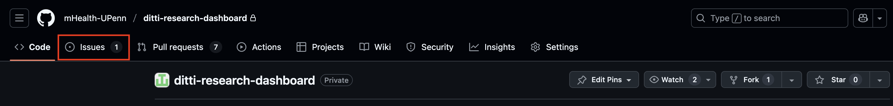
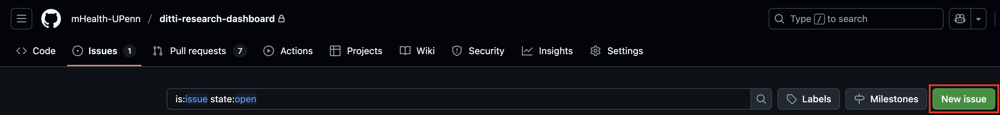

# Contribution Guide

We ask that all contributors first review our [Code of Conduct](./CODE-OF-CONDUCT.md) before making any contributions.

## Submitting Issues

We highly encourage users and contributors of the Ditti Dashboard to use GitHub Issues for reporting any bugs, making feature requests, or posting any other topics of discussion. New topics do not have to be technical in nature, and can be created as discussions open to other users or contributors.

To make posting issues as accessible as possible, we have provided forms for different types of issues. Following are brief instructions for using these forms and templates.

For contributors who are new to GitHub, screenshots are provided below.

### 1. Submitting a Bug Report

To report a bug or unexpected behavior:

1. Navigate to the "Issues" tab of the repository.
2. Click on the "New issue" button.
3. Select the "Bug Report" template.
4. Fill out the form with the required information:
    - **Description**: Provide a detailed description of the bug.
    - **Steps to Reproduce**: Outline the steps required to reproduce the bug.
    - **Expected Behavior**: Explain what you expected to happen.
    - **Environment**: Provide details about your environment (OS, browser, etc.).
    - **Related Issues**: List any related GitHub issues (if applicable).
    - **Additional Context**: Add any other context about the problem (if applicable).
5. Attach any relevant screenshots or error messages.
6. Click "Submit new issue" to create the bug report.

### 2. Submitting a Feature Request

To suggest a new feature or enhancement:

1. Navigate to the "Issues" tab of the repository.
2. Click on the "New issue" button.
3. Select the "Feature Request" template.
4. Fill out the form with the required information:
    - **Description**: Describe the feature or enhancement.
    - **Use Case**: Explain why this feature is important and what problem it solves.
    - **Suggested Solution**: Describe how the feature should work.
    - **Related Issues**: List any related GitHub issues (if applicable).
5. Click "Submit new issue" to create the feature request.

### 3. Submitting Other Issues for Open Discussion

For any issues that do not fit in bug reports or feature requests. Use this template for any other types of open discussion.

1. Navigate to the "Issues" tab of the repository.
2. Click on the "New issue" button.
3. Select the "Other Issue" template.
4. Fill out the form with the required information:
    - **Description**: Provide a description of your issue.
    - **Impact**: Select the impact level of this issue (Low, Medium, High).
    - **Related Issues**: List any related GitHub issues (if applicable).
5. Click "Submit new issue" to create the issue.

### Screenshots

You can **Issues** in the repository navigation bar at the top of the page:



If you want to contribute to an existing discussion, select one from the list of issues. If you want to create a new discussion, you can do so with the **New Issue** button:



## Setting Up the Development Environment

See our [Dev Setup Guide](./INSTALL-dev.md) for details on getting started with a local development environment.

## Submitting Code on GitHub

### Setup the Repository

1. **Clone the repository:**

   ```bash
   git clone ...
   ```

2. **Install recommended VsCode extensions (optional):**

   - [Prettier - Code formatter](https://marketplace.visualstudio.com/items/?itemName=esbenp.prettier-vscode) for formatting the React.js/TypeScript frontend.
   - [ESLint](https://marketplace.visualstudio.com/items/?itemName=dbaeumer.vscode-eslint) for linting the React.js/TypeScript frontend.
   - [markdownlint](https://marketplace.visualstudio.com/items/?itemName=DavidAnson.vscode-markdownlint) for linting any Markdown (README, etc.).
   - [Ruff](https://marketplace.visualstudio.com/items/?itemName=charliermarsh.ruff) for linting and formatting the Flask/Python backend and functions.
   - [Code Spell Checker](https://marketplace.visualstudio.com/items/?itemName=streetsidesoftware.code-spell-checker) for handling any unexpected typos.

3. **Set up your `settings.json` if using VsCode (optional):**

   - This repo comes with a default `settings.sample.json` with the following default settings:
      - Automatic on-save formatting for all Python, TypeScript, and JavaScript.
      - ESLint validation and auto-fixing for JavaScript/TypeScript files.
      - Ruff linting and import organization for Python files.
      - Pytest configuration for running Python tests.
      - Environment file configuration.
      - Spell check configuration for commonly used terms (e.g., "ditti" and "Fitbit").

4. **Bootstrap your development environment:**

   - See our [Dev Setup Guide](./INSTALL-dev.md) for detailed instructions.

### Make your Contributions

We ask that all contributions are divided into atomic pull requests (PRs). The changes in one PR should not depend on the changes of another, and multiple contributions should be made in separate PRs where possible. Smaller PRs are easier to manage, improving the quality and transparency of contributions.

1. **Create a new branch:**

   - Please adhere to our [branching strategy](#branching-strategy).

   ```bash
   cd ...
   git checkout -b <new-branch-name>
   ```

2. **Follow coding conventions:**

   **General:**

      - Ensure all code is formatted according to the pre-defined rules.
      - Any new code in `backend/`, `frontend/`, and `functions/` contain a license statement.
      - Add TODOs as new issues instead of comments in your code.
      - Any new packages or libraries are justified; in-house solutions are generally preferred.

   **Frontend:**

      - Components are organized into a relevant subfolder if they consist of more than one file.
      - Interfaces are defined in separate `types.ts` files alongside their respective components.
      - Use only named exports.

   **Backend:**
      - Any new endpoints include proper access controls (if applicable).
      - Any changes to the database schema include a migration script that does not result in data loss (if applicable).
      - Docstrings are written using the numpy documentation standard.

3. **Commit and push your changes:**

   Never leave a commit message blank. See [this helpful guide](https://cbea.ms/git-commit/) for writing good commits. It is also recommended to make commits [atomic](https://dev.to/samuelfaure/how-atomic-git-commits-dramatically-increased-my-productivity-and-will-increase-yours-too-4a84).

4. **Create a pull request (PR):**

   Navigate to the repository on GitHub and [create a pull request](https://github.com/mHealth-UPenn/ditti-research-dashboard/pulls).

   We have a pull request template to ensure consistency between contributions. Provide a summary followed by a list of detailed changes. If making any changes to the UI, include screenshots. Include steps for reviewers to test your changes, if any. Include related issues, if any.

   The template also includes a checklist of helpful reminders. Go through the checklist to ensure all conditions are met before publishing your pull request.

5. **Monitor status checks:**

   All PRs must pass [status checks](https://github.com/mHealth-UPenn/ditti-research-dashboard/actions) to be merged. Check the status of any failed status check and make the appropriate changes. If a status check is failing for a reason that is beyond the scope of your PR, please [create an issue](https://github.com/mHealth-UPenn/ditti-research-dashboard/issues).

6. **Respond to feedback:**

   Be responsive to feedback and ready to implement suggested changes. Remember, feedback means your work is valued and intended for inclusion!

Thank you for contributing to the Ditti Research Dashboard open source project!

### Branching Strategy

We follow a simplified Git Flow branching strategy:

#### Main Branches

- `main`: Production-ready code
- `staging`: Intermediary branch for staging changes
- `dev`: Integration branch for features

#### Supporting Branches

- `feature/*`: New features
- `bugfix/*`: Bug fixes
- `hotfix/*`: Critical production fixes
- `release/*`: Release preparation

#### Branch Naming Convention

```plaintext
<type>/<github-handle>/<description>
```

Example: `feature/johndoe/add-user-authentication`
